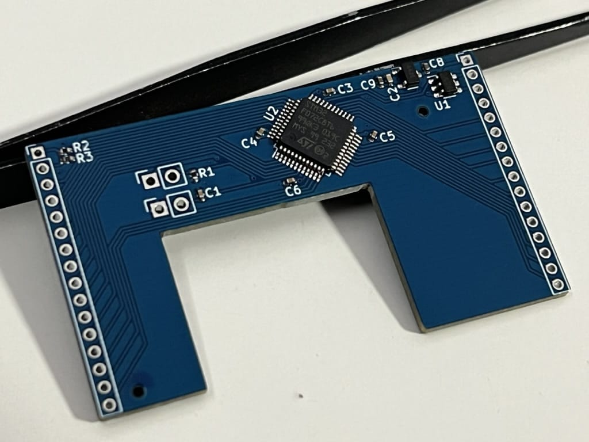
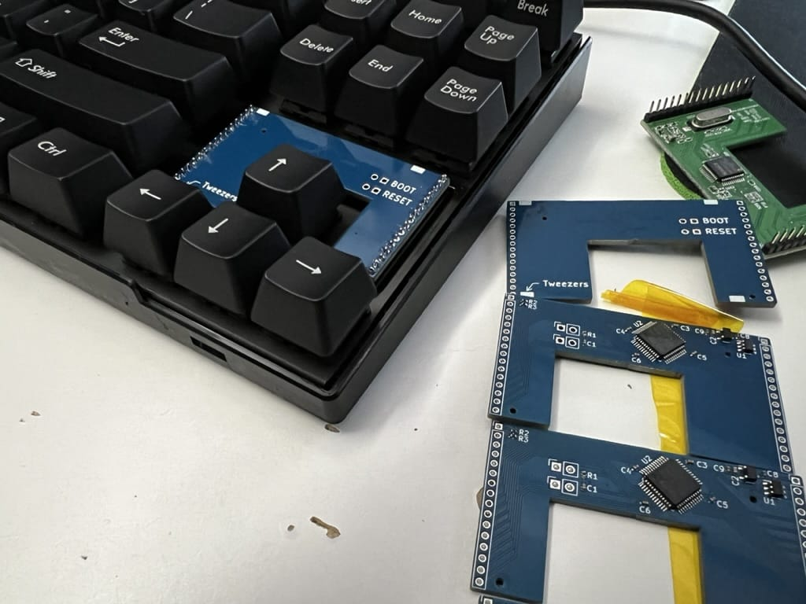

# Majestouch 2 TKL Replacement Controller

This board has been prototyped. It is tested and working

Kicad source files are provided, as well as QMK firmware with Vial support

## Resources Used

- Matrix: <https://deskthority.net/wiki/Controller_matrix_traces#Filco_Majestouch_TKL>
- Outline: <https://github.com/Tecsmith/flying-horse-foot/>
  - Used calipers to double check with physical model